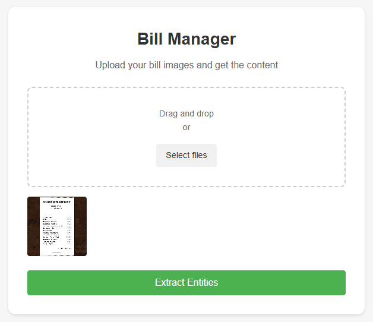

# 💳 Bill Manager

A web-based application that allows users to upload bill images, extract textual data using OCR (Optical Character Recognition), and download the extracted data in JSON format. The backend is powered by ⚡ FastAPI with Tesseract OCR, while the frontend is built with pure HTML, CSS, and JavaScript.

<div align="center">
  
</div>

---

## ✨ Features

- 🖼️ **Drag and Drop Upload**: Easily upload bill images by dragging and dropping files or using the file selector.
- 🔍 **OCR Extraction**: Extract text data from bill images using Tesseract OCR in the backend.
- 📂 **Download JSON**: Download the extracted data in JSON format for further processing or storage.
- 👀 **Real-Time Preview**: Preview uploaded bill images before processing.
- 🎨 **Simple and Clean UI**: A minimalistic and user-friendly interface.

---

## 🛠️ Application Overview

### 🖌️ Frontend

The frontend is built with:
- **HTML**: Provides the structure for the application.
- **CSS**: Handles styling for the user interface.
- **JavaScript**: Implements the logic for drag-and-drop, file uploads, API integration, and displaying results.

### 🚀 Backend

The backend is powered by:
- **FastAPI**: A high-performance Python framework for handling API requests.
- **Tesseract OCR**: An open-source OCR engine for text recognition from images.

---

## 🚀 Getting Started

### 🛒 Clone the Repository

```bash
git clone https://github.com/your-username/bill-manager.git
cd bill-manager
```

### 🏗️ Build and Start the Application with Docker Compose

```bash
docker-compose up --build
```

### 🌐 Access the Application

- **Frontend**: [http://localhost:3000](http://localhost:3000)
- **Backend**: [http://localhost:8000/docs](http://localhost:8000/docs) (Swagger UI)

---

## 📁 Project Structure

```bash
bills_manager/
├── ocr-app/
│   ├── backend/
│   │   ├── Dockerfile
│   │   ├── main.py
│   │   ├── requirements.txt
│   ├── frontend/
│       ├── assets/
│       │   └── UI.png
│       ├── Dockerfile
│       ├── index.html
│       ├── script.js
│       ├── styles.css
├── docker-compose.yml
├── README.md
```

---

## 📡 API Endpoints

### `/extract` (POST)

- **Description**: Upload bill images to extract textual content.
- **Request**: `multipart/form-data`
  - **`files[]` (required)**: One or more images.
- **Response**:
  ```json
  {
    "data": [
      {
        "file_name": "bill1.jpg",
        "text": "Extracted text from the image"
      },
      {
        "file_name": "bill2.jpg",
        "text": "Extracted text from the image"
      }
    ]
  }
  ```

### `/docs` (GET)

- **Description**: Access the interactive API documentation.

---

Enjoy managing your bills with **Bill Manager**! 🚀
